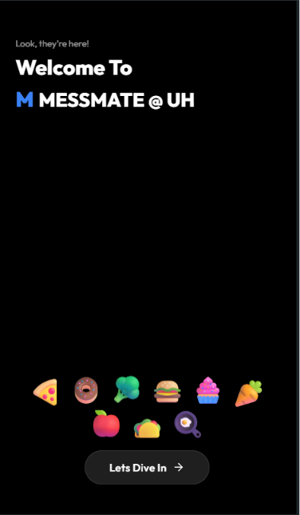
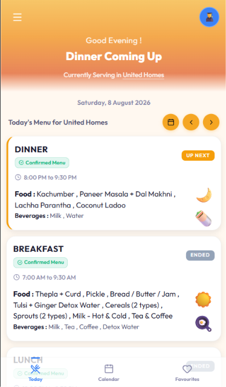
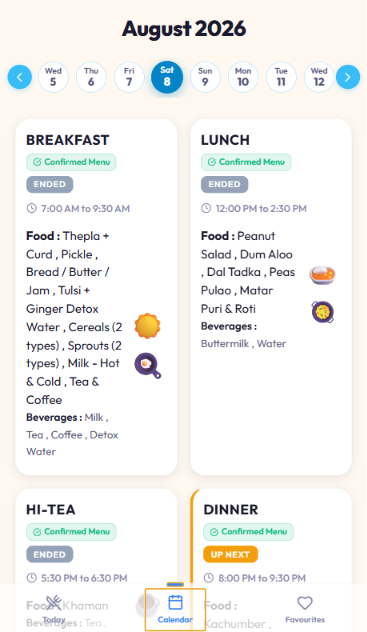
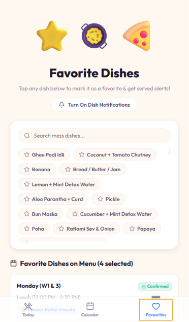
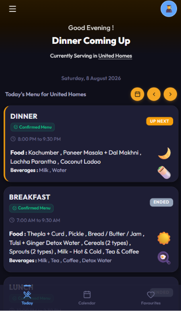
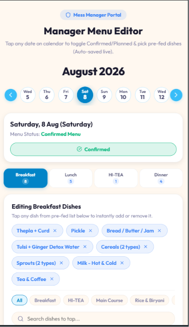

# 🍽️ MESS MATE @ UH

> **Real-time Mess Menu for United Homes, Karnavati University**

MESS MATE @ UH is a modern web application built for the **United Homes** off-site hostel of **Karnavati University**. It provides students with accurate, real-time mess menu updates instead of relying solely on the monthly printed menu, which often changes.

The platform helps students instantly know **what's actually being served**, meal timings, and any updates made by the mess administration.

---

## ✨ Features

- **Today's Live Menu** — Instantly see what's being served right now, along with upcoming and completed meals.
- **Calendar View** — Browse the weekly menu using an intuitive, swipeable date selector.
- **Favourite Dishes** — Save your favourite dishes and receive alerts when they're on the menu.
- **Planned vs Confirmed Menu** — Clearly identify whether today's menu is planned or officially confirmed.
- **Dark Mode** — Switch between light and dark themes for a comfortable viewing experience.
- **Install as an App (PWA)** — Add MESS MATE to your home screen for quick, app-like access.

## 📸 Screenshots

<table>
  <tr>
    <td align="center"> Welcome</td>
    <td align="center"> Today's Live Menu</td>
    <td align="center"> Calendar / Weekly Menu</td>
  </tr>
  <tr>
    <td align="center"> Favourite Dishes</td>
    <td align="center"> Dark Mode</td>
    <td align="center"> Manager / Admin Panel</td>
  </tr>
</table>

### 👨‍🍳 For Mess Administration / ADMINS

- **Quick Menu Updates** — Update today's menu in seconds.
- **Real-Time Synchronization** — Changes are reflected instantly for all students.
- **Publish or Edit Menus** — Modify meals at any time during the day.
- **Menu Status Management** — Mark menus as *Planned* or *Confirmed*.
- **Multi-Day Planning** — Prepare menus in advance for upcoming days.
---

## 🎯 Problem

The hostel shares a monthly menu, but the food served often differs from the schedule.

Students frequently have no reliable way to know the actual menu until they arrive at the mess.

MESS MATE solves this by displaying the **live menu** with instant updates.

---

## 🚀 Tech Stack

- React
- Vite
- Tailwind CSS
- Firebase Firestore
- Firebase Authentication
- Vercel

---

## 🌍 Future Vision

MESS MATE is currently built for **United Homes (UH)** but is designed to support multiple hostels in the future(if needed).

---

## 👨‍💻 Developed by

**Souryajeet Singh**

Built to improve the dining experience for students at United Homes.